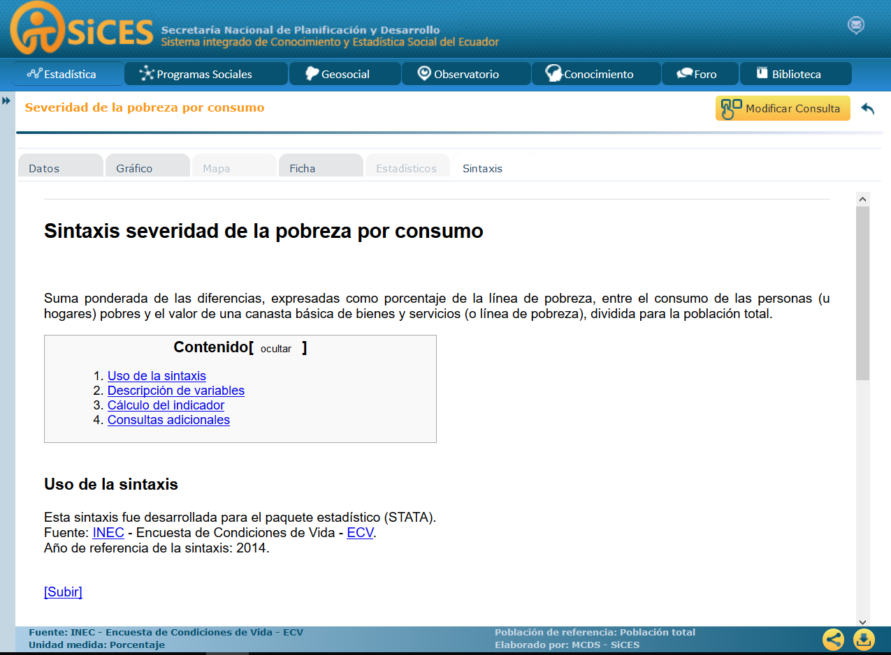
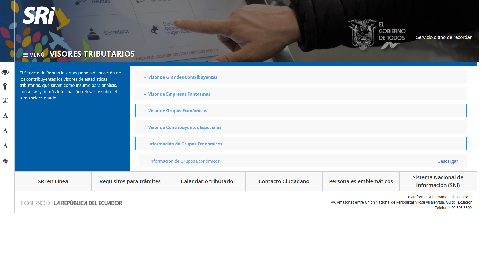
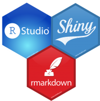

background-image: url("lab_soc_logo.jpeg")
background-size: cover

---

background-image: url("front_imgae.png")


```{r setup, include=FALSE}
options(htmltools.dir.version = FALSE)
```

---
class: center, middle

# Benchmark

---
class: inverse, center, middle

# A nivel mundial

---
class: inverse, center, middle

# SENSEable city lab

.center[]

Más visualizaciones en: [SENSEable city lab](http://senseable.mit.edu/)

---

# Monitour

.pull-left[


]

.pull-right[

### Página de bienvenida

Elementos

- Título llamativo

- Descripción del tema
  
  - Colaboradores
  
  - Motivaciones

- Botón de lanzamiento 

- Enlaces que permiten ampliar el conocimiento sobre el tema

Más información: [MIT Monitour](http://senseable.mit.edu/monitour/)

]

---

# Monitour

.pull-left[

### Guia de usuario

Previo al uso de la herramienta se presentan en breves instrucciones los pasos a seguir.

El equipo de trabajo se presenta con sus respectivos cargos. Ésta, al igual que el laboratorio social se realiza en un marco colaborativo.

El usuario tiene toda la información antes de usar la herramienta.

]

.pull-right[


]

---

# Monitour

.pull-left[

### Aun más información
<center>


]

.pull-right[


Incluso dentro de la aplicación se detalla el marco en el que fue desarrollada la herramienta. 

Así mismo, antes de empezar se esboza la metodología y la motivación.

]

---

# Monitour

.pull-left[

### La herramienta en acción
<center>


]

.pull-right[

### Especifiaciones

Monitour fue desarrollado con:

- [Mapbox:](https://www.mapbox.com/about/maps/) herramienta de integración de localizaciones para aplicaciones web y moviles.

- [JQuery:](https://jquery.com/) versión simplificada y versatil de JavaScript. Crea elementos interactivos y asignación facíl de formatos.

- [D3.js:](https://jquery.com/) da vida a los datos con visualizaciones dinámicas.
]


---
class: inverse, center, middle

# DATA U.S.A

.center[]

Más visualizaciones en: [DATA USA](https://datausa.io/)

---
class: center

# Home Page


- Con el slogan resumen todas las posibilidades sobre el uso de la página. 

- La información no se presenta sino hasta que el usuario elige el tiema de interes.

---

# Construction

.pull-left[


### Presentación de estadísticas preliminares
- El usuario tiene un primer vistazo de la información que busca y puede generar sus propias estadísticas/indicadores. 
]

.pull-right[


### Navegación de ida y vuelta
- El usuario siempre tiene la opción de volver a la home page, o a instancias previas del mismo tema.
- La información presentada está correctamente citada y vinculada.
]

---
class: center

# Construction

## Diversidad de visualización

.pull-left[


]

.pull-right[


]


---

# Construction


.pull-left[


]

.pull-right[

### Un gran reporte

- DATA USA está construido como un reporte dinámico de gran extensión. 

- Todas las visualizacones están correctamente interpretadas para un caso específico y son reactivas a la actividad del usuario

- En cada una de las visualizaciones existe la posibilidad de interconexión simultanea de los datos subyacentes con opción de descarga.

]
---
# Construction

.pull-left[


]

.pull-right[
### Información adicional

- Se presenta toda la información correspondiente tanto al desarrollo de la herramienta, así como la información técnica. Ésta última de fácil interpretación para cualquier tipo de usuario.

### Especificaciones
- DATA USA está desarrallado con [D3plus](http://d3plus.org/) herramienta precisa para desarrollar documentos dinámicos alimentados por datos.


]

---
class: inverse, center, middle

# Otros a nivel mundial

---
class: inverse, center, middle

# Observatory of Economic Complexity


Más visualizaciones en: [Observatory of Economic Complexity](https://atlas.media.mit.edu/en/)

---
class: inverse, center, middle

# Data Viva

.center[]

Más visualizaciones en: [Data Viva](http://www.dataviva.info/en/)


---
class: inverse, center, middle

# A Nivel Nacional

---
class: inverse, center, middle

# SICES


Más visualizaciones en: [Sistema Integrado de Conocimiento y Estadística Social - SICES](http://www.conocimientosocial.gob.ec/)

---

.pull-left[
### Presentación


### Listado de indicadores


]

.pull-right[
### Sintaxis


### Mapa


]

---

.pull-left[

## Especificaciones

- La información está dispersa.

- No se especifica el proposito de la herramienta, solo los temas.

- El visualizador fue desarrollado en [JavaServer Faces (JSF)](http://www.javaserverfaces.org/) es decir que es una interfaz realizada en Java para servicios Web.

- No existe información sobre el equipo colaborador en el desarrollo de la herramienta ni de su contexto.
- No hay una guia de usuario que permita el conocimiento antes de usar la herramienta.


]

.pull-right[
### Conocimiento


### Biblioteca


]

---
class: inverse, center, middle

# SRI


Más visualizaciones en: [Visores tributarios ](http://www.sri.gob.ec/web/guest/visores-tributarios)

---


.pull-left[
### Visualizador de empresas fantasma


### Otros visualizadores


]

.pull-right[
### Información adicional

- En la actualidad solo está funcional el visor de empresas fantasmas. El resto de opciones dirigen a la descarga de un archivo excel.
- Existe limitación en la acciones que puede realizar el usuario. 

### Especificaciones
- El visualizador disponible está desarrallado con [Qlik Sense](https://www.qlik.com/es-es/products/qlik-sense) herramienta precisa para desarrollar aplicaciones en base a un **motor asociativo** el cual indexa las relaciones entre los datos para mayor velocidad de respuesta.


]
---
class: inverse, center, middle

# INEC


Más visualizaciones en: [Visualizadores Estadísticos ](http://www.ecuadorencifras.gob.ec/visualizadores-estadisticos/)

---


.pull-left[
### Estadísticas Productivas


### VDatos


]

.pull-right[
##### Sistema Integrado de Clasificaciones y Nomenclaturas (SIN)


### REDATAM


]

---
# Resumen

- Las herramientas de visualización tinene un alto poder de impacto para transmitir ideas.

- En la actualidad están a disposición un sin número de alternativas para generar este tipo de herramientas.

- El enfoque siempre debe tener como prioridad el usuario. 
- La distribución de la información debe ser coherente con el fin con el que se creo la herramienta.

- Las herramientas de visualización deben estar respaldadas por un equipo que le dé seguimiento en el tiempo.

- La variedad de talento humano, lo mismo que la educación del vigente, puede derivar en mejoras sustanciales en la realización de las mismas.

- En los visualizadores nacionales existe una separación de la información/interpretación y de las visualizaciones.

- Muchos clicks para llegar a un resultado.


---
class: inverse, center, middle

# ¿Por que Shiny?



Documentación en: [Shiny R](https://shiny.rstudio.com/)

---

background-image: url("deploy.png")
background-size: contain

---
class: center, middle

# Especificaciones
.pull-left[
- Tanto R, RStudio, y Shiny tienen basta documentación con aportes constantes a nivel mundial.
- Multiples formas de transmitir datos o [hosting modes](https://docs.rstudio.com/shiny-server/#hosting-model)
- Cuenta con su propia integración con **D3** lo cual permite la creación de documentos dinámicos.
- **Leaflet** es solo una de las interfaces para la realización de mapas.
- Shiny tiene facilidad de integracion con **Java Script**
- *R* es amigable en la inegración de otros lenguajes 
]

.pull-right[


]

---
class: middle
.pull-left[
## Necesidades

- **Comunicación:** Gestión de imagenes que puedan ser empleadas de tal manera que se guarde coherencia con la imagen institucional del INEC.
- **Registros Administrativos:** Otorgamiento de permisos para la publicación de los datos subyacentes.
- **Tecnología:** Guia en el proceso de montaje de la aplicación en el dominio del INEC. Previo a ello, el otorgamineto de un dominio de pruebas para presentaciones preliminares.
]

.pull-right[
## Potencialidades:

App en acción: [Superzip Example](https://shiny.rstudio.com/gallery/superzip-example.html)


App en acción: [CRAN STATS](https://nz-stefan.shinyapps.io/cran-explorer/#cran-stats)
]
---
class: center,  middle

# Características del visualizador:


---
class: center,  middle

# GRACIAS
